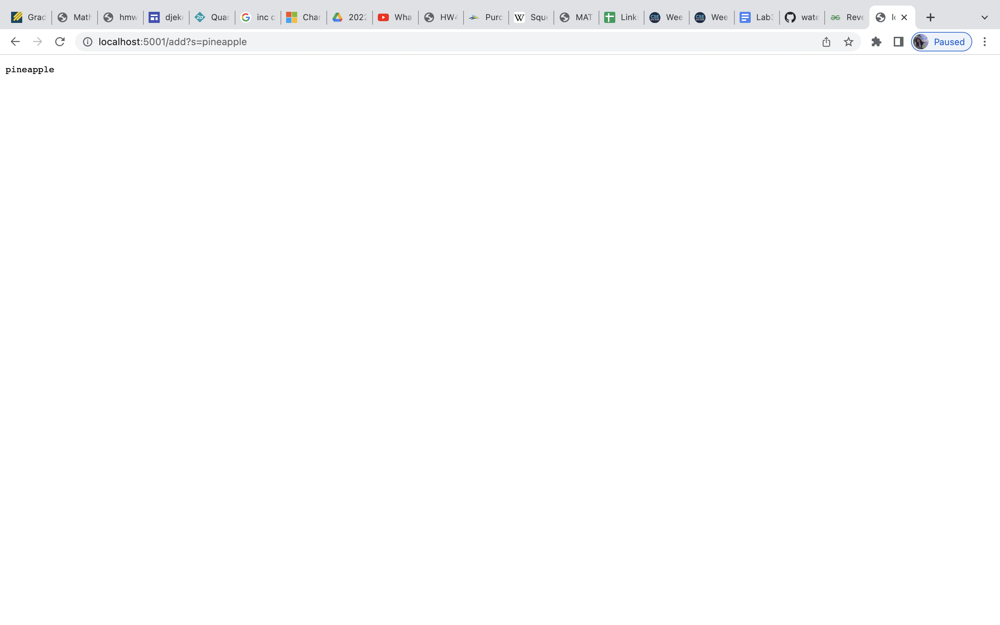
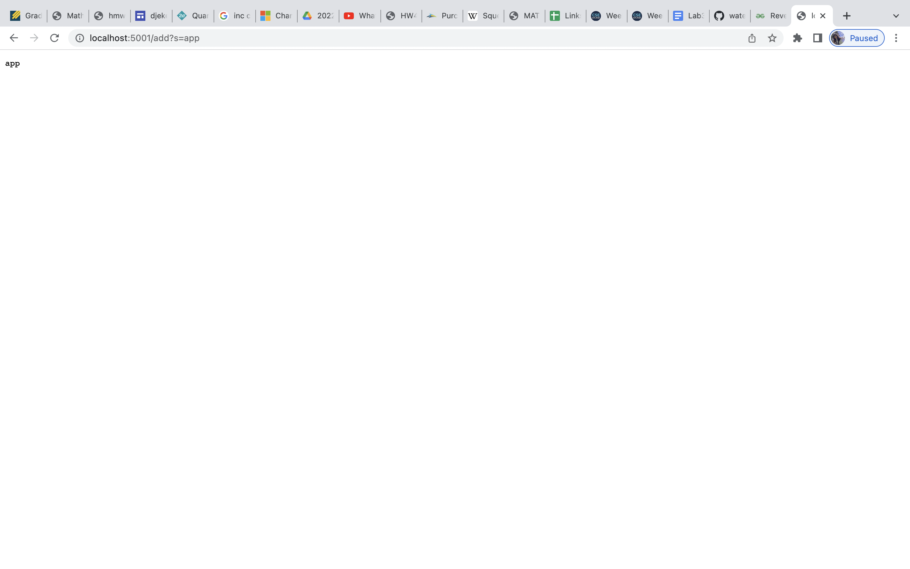
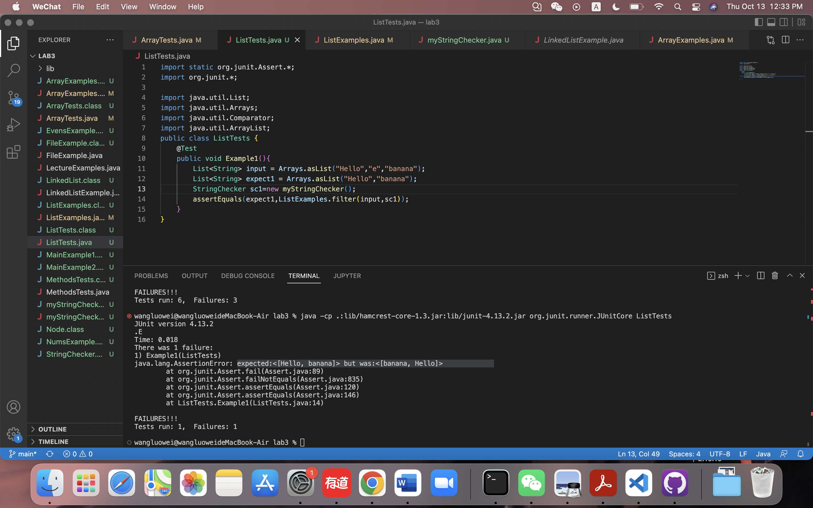
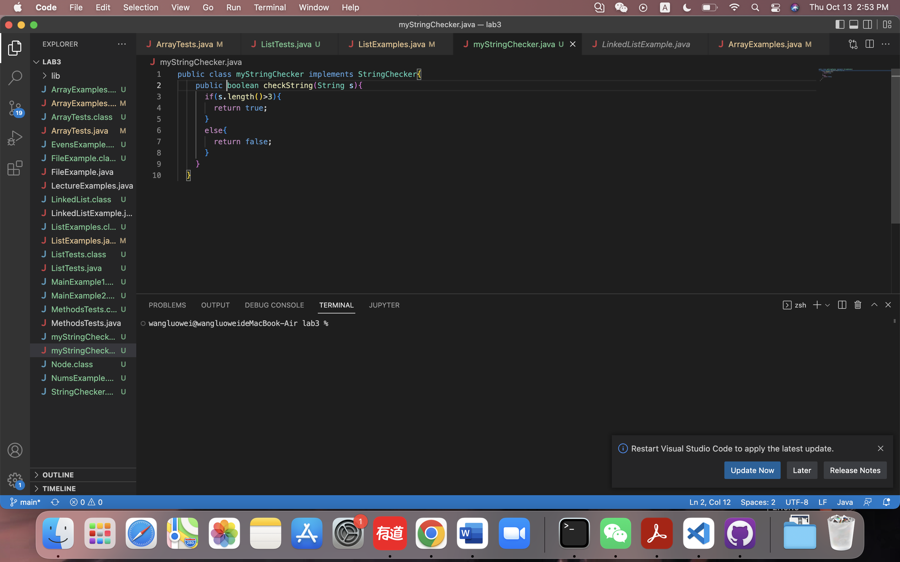
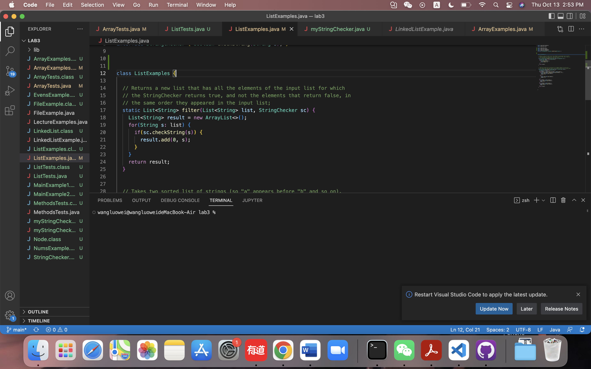
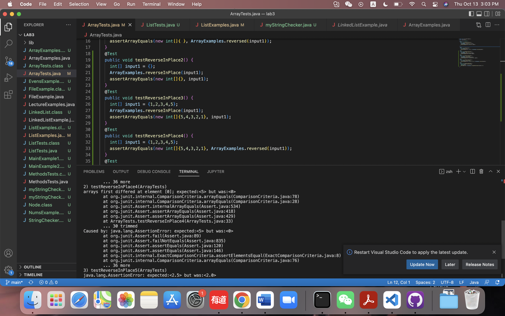

# Part1
```
import java.net.URI;
import java.util.ArrayList;
class Handler implements URLHandler {
    // The one bit of state on the server: a number that will be manipulated by
    // various requests.

    ArrayList<String> result = new ArrayList<String>();
    public String handleRequest(URI url) {
        System.out.println("Path: " + url.getPath());
        if (url.getPath().contains("/add")) {
            String[] parameters = url.getQuery().split("=");
                if (parameters[0].equals("s")) {
                    result.add(parameters[1]);
                }
                return parameters[1];
        }
        else if (url.getPath().contains("/search")) {
            String[] parameters = url.getQuery().split("=");
            String s1="";
            for(int i=0;i<result.size();i+=1){
                if(result.get(i).contains(parameters[1])){
                    s1+=result.get(i)+" ";
                }
            }
            return s1;
        }
        else{
            return "404 Not Found!";
        }                       
    }
}

class SearchEngine {
    public static void main(String[] args) throws IOException {
        if(args.length == 0){
            System.out.println("Missing port number! Try any number between 1024 to 49151");
            return;
        }

        int port = Integer.parseInt(args[0]);

        Server.start(port, new Handler());
    }
}
```
When we enter this URL, we call the handleRequest method. The input is the URL. The path of it contains "/add" so it enters the first if condition.<br> We split the query with "=" and create a new string array parameters. Since the first element of parameters is "s", we add<br> the second element of parameters to the list called result, which is created in the class Handler. And we wil return the second<br> element of parameters, which here is pineapple. So, now "pineapple" is added to result.

Similarly, this time, we add "app" to the list called result. result now is {"pineapple", "app"}.

When we enter this URL, we call the handleRequest method. The path of it contains "/search" so it enters the second if condition.<br>
We split query with "=" and create a new string array parameters. Create an empty string called s1. parameters[1] is "app", the string that <br> we are searching for. The result now contains "pineapple" and "app", and both contain "app." The for loop will add "pineapple" and "app" to s1 and will return s1. s1 is "pineapple app ".
# part2
## bug1
my input is Arrays.asList(“Hello”, “e”, “banana”) and my stringchecker will check if the string is longer than 3. expected:<[Hello, banana]> <br>but was:<[banana, Hello]>. The bug is that we add new selected element to index 0. We can fix this by just using result.add(s) rather <br>than result.add(0,s).<br>



## bug2
For test method testReverseInPlace4, My input is [1,2,3,4,5] and I expect the input to be [5,4,3,2,1]. The symptom is that arrays first <br>differed at element [0]; expected:<5> but was:<0>. This is because we assign the value of the original array to the new array we <br>created. So the value is all 0, which is the default value for a new array.<br>

